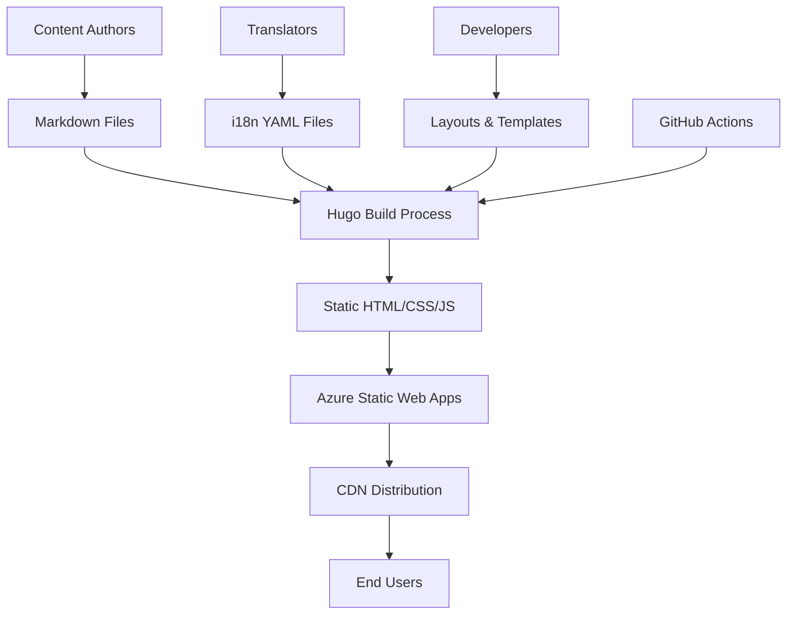

# 🏗️ Architecture Overview

This document provides a detailed overview of the Open Guide to Kanban's technical architecture and design decisions.

## Technology Stack

### Core Technologies

- **[Hugo](https://gohugo.io/)** - Static site generator (Extended v0.146.0+ required for new template system)
- **[Bootstrap 5](https://getbootstrap.com/)** - CSS framework for responsive design
- **[Font Awesome](https://fontawesome.com/)** - Icon library
- **[Azure Static Web Apps](https://azure.microsoft.com/services/app-service/static/)** - Hosting platform

### Development Tools

- **Git** - Version control
- **GitHub Actions** - CI/CD pipeline
- **PowerShell** - Scripting and automation
- **Markdown** - Content authoring

## System Architecture



## Directory Structure Deep Dive

### `/site/` - Hugo Source

The main Hugo site directory containing all source files:

```text
site/
├── content/           # Markdown content files
│   ├── _index.md     # Homepage content
│   ├── creators/     # Creator profiles
│   ├── download/     # Download pages
│   └── guide/        # Main guide content
├── layouts/          # HTML templates (Hugo v0.146.0+ structure)
│   ├── baseof.html   # Base template (moved from _default/)
│   ├── home.html     # Homepage template (renamed from index.html)
│   ├── single.html   # Single page template (moved from _default/)
│   ├── list.html     # List template (moved from _default/)
│   ├── guide/        # Guide-specific layouts
│   ├── creators/     # Creator-specific layouts
│   ├── _partials/    # Reusable components (renamed from partials/)
│   ├── _shortcodes/  # Custom shortcodes (renamed from shortcodes/)
│   └── _markup/      # Render hooks for markdown elements
├── static/           # Static assets
│   ├── css/         # Custom stylesheets
│   ├── images/      # Images and graphics
│   └── pdf/         # PDF files
├── data/            # Structured data files
├── i18n/            # Translation files
└── hugo.yaml        # Hugo configuration
```

### `/docs/` - Documentation

Comprehensive project documentation for contributors and maintainers.

### `/public/` - Generated Output

Auto-generated static site files (not committed to version control in production).

### Configuration Files

- `hugo.yaml` - Main Hugo configuration
- `hugo.*.yaml` - Environment-specific configurations
- `staticwebapp.config.*.json` - Azure Static Web Apps configurations

## Content Architecture

### Multilingual Support

The site supports multiple languages using Hugo's built-in i18n features:

- **English** (`en`) - Default language
- **German** (`de`) - Deutsch
- **Spanish** (`es`) - Español
- **French** (`fr`) - Français

### Content Types

1. **Guide Content** - Main Kanban content
2. **Creator Profiles** - Information about authors
3. **Download Pages** - PDF and resource downloads
4. **Static Pages** - About, legal, etc.

## Template Hierarchy

Hugo's new template system (v0.146.0+) follows a streamlined lookup order that considers multiple identifiers:

### Template Lookup Order

1. **Custom Layout** - Defined in front matter (`layout: myCustomLayout`)
2. **Page Kinds** - `home`, `section`, `taxonomy`, `term`, `page`
3. **Standard Layouts** - `list`, `single`, `all`
4. **Output Format** - `html`, `rss`, `json`
5. **Language** - `en`, `de`, `es`, etc.
6. **Page Path** - Content-specific paths for targeted templates

### Key Template Changes

- **No `_default/` folder**: All default templates moved to `layouts/` root
- **Renamed folders**: `partials/` → `_partials/`, `shortcodes/` → `_shortcodes/`
- **New `_markup/` folder**: For render hooks (links, images, code blocks)
- **Homepage template**: `index.html` → `home.html`
- **Base templates**: `list-baseof.html` → `baseof.list.html`

### Template Examples

For a guide page (`/guide/my-guide/`), Hugo looks for templates in this order:

1. `layouts/guide/my-guide/single.html` - Most specific
2. `layouts/guide/single.html` - Content type specific
3. `layouts/single.html` - Default single template
4. `layouts/baseof.html` - Base template

### Key Templates

- **`baseof.html`** - Base template with common HTML structure
- **`home.html`** - Homepage template (renamed from `index.html`)
- **`single.html`** - Individual page template
- **`list.html`** - List/index page template
- **`all.html`** - New catch-all template for any page type

## Build Process

### Development Build

```bash
cd site
hugo server -D --bind 0.0.0.0 --port 1313
```

### Production Build

```bash
cd site
hugo --minify --environment production
```

### Environment Configurations

- **Local** (`hugo.local.yaml`) - Development settings
- **Preview** (`hugo.preview.yaml`) - Preview/staging settings
- **Canary** (`hugo.canary.yaml`) - Canary release settings
- **Production** (`hugo.yaml`) - Production settings

## Deployment Architecture

### Azure Static Web Apps

The site is deployed using Azure Static Web Apps with:

- **Automatic builds** from GitHub Actions
- **Custom domains** support
- **SSL certificates** automatically managed
- **CDN distribution** globally
- **Environment-specific deployments**

### Deployment Environments

1. **Production** - Main live site
2. **Preview** - Staging environment
3. **Canary** - Early access features

## Performance Considerations

### Optimization Strategies

- **Static generation** - No server-side processing
- **Minification** - CSS, JS, and HTML minification
- **Image optimization** - Responsive images and WebP support
- **CDN delivery** - Global content distribution
- **Caching headers** - Aggressive caching for static assets

### Build Performance

- **Incremental builds** during development
- **Asset bundling** and minification
- **Template caching** for faster rebuilds

## Security Architecture

### Content Security

- **Static files only** - No server-side vulnerabilities
- **HTTPS only** - All traffic encrypted
- **CSP headers** - Content Security Policy implementation

### Access Control

- **Repository access** - GitHub permissions
- **Deployment access** - Azure permissions
- **Review process** - Pull request requirements

## Monitoring and Analytics

### Built-in Monitoring

- **Google Analytics** - Traffic and user behavior
- **Azure Application Insights** - Performance monitoring
- **GitHub Actions** - Build and deployment status

### Content Metrics

- **Page views** per language
- **Download statistics** for PDFs
- **User engagement** metrics

## Extensibility

### Adding New Languages

1. Create new i18n file in `i18n/[lang].yaml`
2. Add language configuration in `hugo.yaml`
3. Create translated content in `content/` directory
4. Update navigation templates

### Adding New Content Types

1. Create content archetype in `archetypes/`
2. Design specific layout in `layouts/`
3. Configure front matter requirements
4. Update navigation and menus

### Custom Functionality

- **Shortcodes** for reusable content components
- **Partial templates** for shared functionality
- **Data files** for structured content
- **Custom CSS/JS** for enhanced features

## Future Considerations

### Scalability

- **Content growth** - Efficient content organization
- **Language expansion** - Additional translations
- **Feature additions** - New content types and functionality

### Technology Updates

- **Hugo updates** - Regular framework updates
- **Dependency management** - Bootstrap and other libraries
- **Security patches** - Keeping dependencies current

---

🔙 **Back to**: [Documentation Home](./README.md)  
➡️ **Next**: [Development Guide](./development.md)
